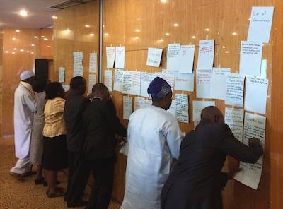

{: .aside :}

The World Bank's Open Government Data Working Group developed an Open Data Readiness Assessment (ODRA) methodological
tool that can be used to conduct an action-oriented assessment of the readiness of a government or individual agency to
evaluate, design and implement an Open Data initiative. As part of the Open Government Data Toolkit, this tool is freely
available for others to adapt and use.

**New in Version 3:** the ODRA has been re-organized and improved to make it easier to understand and use.
The ODRA now consists of two documents: the User Guide and the Methodology. Version 3.1 is a minor
update that includes additional guidance for the legal/policy section and corrects some minor errors, but does
not include any methodological changes.

## Download the ODRA ## {#download}

* **User Guide:** [PDF](../docs/odra/odra_v3.1_userguide-en.pdf) \| [MS Word](../docs/odra/odra_v3.1_userguide-en.doc)
* **Methodology:** [PDF](../docs/odra/odra_v3.1_methodology-en.pdf) \| [MS Word](../docs/odra/odra_v3.1_methodology-en.doc)
* **Webinar (March, 2016):** [PDF](../docs/odra/ODRA_31_WhatsNew.pdf)

## Available Assessments ##

* **Ulyanovsk, Russian Federation** (January, 2013): [Full Report](../docs/odra/odra_ulyanovsk_web_final.doc)
* **Antigua & Barbuda** (June, 2013): [Full Report](http://www.ab.gov.ag/article_details.php?id=4222&category=114) \| [Press Release](http://www.ab.gov.ag/article_details.php?id=4223&category=38)
* **Peru** (June/July, 2013): [Full Report](../docs/odra/odra-peru-final.pdf) - Spanish only
* **Mexico** (September/October, 2013): [Full Report](../docs/odra/odra_mexico_complete.pdf) - Spanish \| [Executive Summary](./docs/odra/odra_mexico_execsummary.pdf) - English
* **Dominican Republic** (April/May, 2014): [Full Report](../docs/odra/odra_republica_dominicana.pdf) - Spanish only
* **Burkina Faso** (June, 2014): [Full Report](../docs/odra/odra-burkina-faso-final-fr.pdf) - French (Executive Summary & Action Plan also in English)
* **Kazakhstan** (2014, self assessment): [Russian](../docs/odra/odra_kazakhstan-ru.docx) \| [English](../docs/odra/odra_kazakhstan-en.docx)
* **Uganda** (June, 2015): [Full Report](../docs/odra/odra_uganda.pdf) \| [Report Annexes](../docs/odra/odra_uganda_annexes.pdf)
* **Tajikistan** (June, 2015): [Full Report](http://cipi.tj/wp-content/uploads/2015/09/En_ODRATajikistan_2015.pdf)
* **Sierra Leone** (Nov, 2015): [Full Report](../docs/odra/odra_sierra_leone.pdf)
* **Serbia** (December, 2015): [Full Report]
(http://www.rs.undp.org/content/serbia/en/home/library/democratic_governance/open-data-readiness-assesment-)
* **Kyrgyzstan** (February, 2016): [Full Report](http://www.kg.undp.org/content/kyrgyzstan/en/home/library/democratic_governance/odra) - English & Russian

**[Request the World Bank to perform a readiness assessment](mailto:opengovdata@worldbank.org)**
{: .center .space-before .space-after :}

## Other Resources ##

You can [watch a briefing](mms://wbmswebcast1.worldbank.org/DEC/2013-03-01/OD_RA_Briefing.wmv) (requires [Windows Media
Player](http://windows.microsoft.com/en-us/windows/windows-media-player)) delivered on March 1, 2013 by Andrew Stott and
Jeff Kaplan, the primary authors of the ODRA methodology. Their [presentation is available
here](../docs/odra/2013-03-01_0900_open_data-odra_briefing.pdf).

### Translations (Unofficial) ###

* **French** (Version 2): [PDF](../docs/odra/odra_v1-fr.pdf) \| [MS Word](../docs/odra/odra_v1-en.docx)
* **Russian** (Version 2): [PDF](../docs/odra/odra_v2-ru.pdf) \| [MS Word](../docs/odra/odra_v2-ru.docx)

### Previous ODRA Versions ###

(English only)

* **3.0 User Guide:** [PDF](../docs/odra/odra_v3_userguide-en.pdf) \| [MS Word](../docs/odra/odra_v3_userguide-en.doc)
* **3.0 Methodology:** [PDF](../docs/odra/odra_v3_methodology-en.pdf) \| [MS Word](../docs/odra/odra_v3_methodology-en.doc)
* **2.0 User Guide:** [PDF](../docs/odra/odra_v2-en.pdf) \| [MS Word](../docs/odra/odra_v2-en.doc)

### Sector Specific Assessment Tools ### {#sector-tools}

#### Open Energy Data Assessment ####

This tool assists energy stakeholders and related authorities in
assessing and planning what actions to consider in order to strengthen the use of open data in the 
energy sector at a national or local level.

* **Methodology:** [MS Word](../docs/odra/odra_energy_v1_methodology-en.docx) 
* **Completed Assessments**
  * **Nairobi, Kenya** (November, 2015): [Full Report](../docs/odra/odra_energy-nairobi.pdf)
  * **Accra, Ghana** (November, 2015): [Full Report](../docs/odra/odra_energy-accra.pdf)

#### Open Data For Business (OD4B) Tool #### {#OD4B}

The Open Data for Business (OD4B) Tool provides a methodology to assess the private sector's current and potential use of government data in various countries.

* **Methodology:** [PDF](../docs/odra/od4b_v2.8-en.pdf)
* **Supplements:** [Annex 7](../docs/odra/od4b_v2.8_annex7.xlsx) \| [Annex 8](../docs/odra/od4b_v2.8_annex8.xlsx)
* **OD4B-Sierra Leone** (Jan, 2015): [PDF](../docs/odra/od4b_sierra_leone.pdf)

