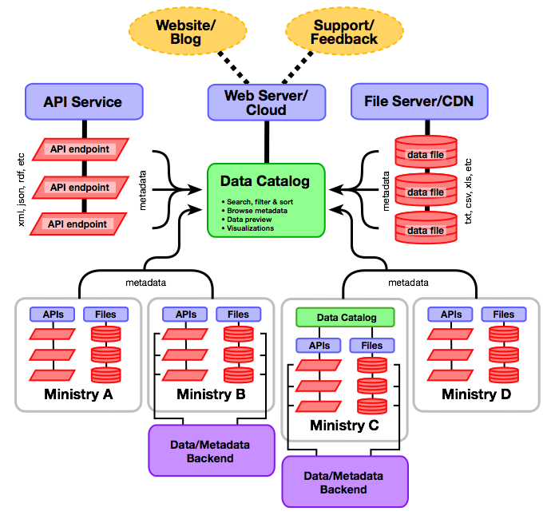

This section provides guidance on the selection and implementation of various technologies used to develop Open Data
platforms, with a particular focus on Open Data catalogs, which are the web-based systems used to make data available to
end users. It is intended to support IT specialists who play a lead or coordinating role in managing the technical
infrastructure of an Open Data initiative.

## What does an Open Data Platform Look Like?

An Open Data platform provides an online "front door" for end users to access the data and resources available under an
Open Data initiative. Typically, an Open Data platform is a synthesis of different products and services, such as a data
catalog, which provides easy access to available datasets; an online forum for questions, technical support and
feedback; a knowledge base of background and training materials; a blog for communications and outreach; and an events
calendar. These services are often delivered via different products designed for specific purposes and interoperability,
as opposed to a single product that does everything.

The centerpiece of an Open Data platform is typically a data catalog. As described in the following paragraphs, data
catalogs can be relatively simple and "stand alone," or they can be very sophisticated and integrated with other
systems. Most Open Data catalogs, however, share a few common characteristics (more extensive lists are [also
available](https://checklists.opquast.com/en/opendata)):

* **Easy access**. Open Data catalogs make it very easy for users to access data quickly, freely and intuitively. Access
to Open Data catalogs requires no registration or login, since such requirements would discourage exploration and use.

* **Search**. Open Data catalogs make data easy to find. Most data catalogs sort data by subject, organization or type,
and support [full text searching](http://en.wikipedia.org/wiki/Full_text_search) of catalog contents. Many Open Data
catalogs implement [search engine optimization](http://en.wikipedia.org/wiki/Search_engine_optimization) to expose data
to conventional search engines.

* **Machine-readable data access**. Data are available for download in [machine-readable, non-proprietary electronic
formats](essentials.html#definition). To the extent possible, the preference is to have all data in a dataset available
as a single download file.

* **Metadata**. Key metadata, such as publication date and attribution, are prominently displayed for each dataset. Many
Open Data catalogs implement the [Dublin Core metadata standard](supply.html#metadata) and make the metadata available
in machine-readable formats.

* **Clear data licenses**. [Data licenses](essentials.html#licenses) are clearly and prominently displayed for each
dataset. If data are licensed under Creative Commons, the Open Data License or other standards, transparent links to
these licenses are included.

* **Data preview/visualization**. Many Open Data catalogs include some facility to preview the data prior to download,
or to visualize the data using built-in graphing or mapping tools.

* **Standards compliance**. Most Open Data catalogs have built-in support for various standards, such as [data
formats](http://opendatahandbook.org/en/appendices/file-formats.html) (e.g., CSV, XML, JSON) and
[metadata](supply.html#metadata) (i.e., Dublin Core). Open Data catalogs typically make each dataset available as a
unique and permanent URL, which makes it possible to cite and link to the data directly.

* **Application Programming Interface (API)**. APIs allow software developers to access
the Open Data catalog -- and often the data itself -- through software. APIs facilitate data discovery, analysis,
catalog integration, [harvesting of metadata](https://www.data.gov/developers/harvesting) from external sites and a
host of applications.

* **Security**. Open Data catalogs implement security measures to protect data and metadata from being changed by
unauthorized users.

Open Data catalogs generally follow one of two service delivery models. **Open Source** platforms are nominally "free,"
in that they may be acquired via download for no cost, and may be modified or customized without restriction or
licensing fees. These products can be hosted on dedicated servers or on cloud-based infrastructure, but both approaches
require the catalog operator to manage IT logistics; some vendors provide cloud-hosting of open source products as a
service.  In contrast, **Software as a Service** (SaaS) products are available from various vendors for a monthly or
annual fee, and vendors assume responsibility for IT management, security and software updates. SaaS vendors may also
provide training and some measure of customization.

## Four Models of an Open Data Catalog {#models}

Click a graphic below to view it at full size.

<ul>
<li><a id="model1-click" href="#model1">Model 1</a></li>
<li><a id="model2-click" href="#model2">Model 2</a></li>
<li><a id="model3-click" href="#model3">Model 3</a></li>
<li><a id="model4-click" href="#model4">Model 4</a></li>
</ul>

### Model 1: Single Platform

This model demonstrates a simple IT infrastructure where the data catalog and data files are hosted within a single
server environment. The server could be managed internally by the lead agency or it could be cloud-hosted. API-driven
datasets, if any, may be managed separately according to the requirements for the underlying technology.

Blogging, user support, and feedback are essential elements of user engagement in an Open Data initiative, and can often
be provided by the same or similar infrastructure as that used by the catalog itself. Conceptually, though, they are
separate systems that are only loosely connected to the data catalog.

This model is suitable where there are a small number of datasets (less than 200) in the data catalog, datasets are
small (less than 100Mb), and a single agency plays a strong role in coordinating the data catalog and managing the IT
infrastructure.

### Model 2: Separate Servers

This model demonstrates how the data catalog and file server might be managed separately using either internally hosted
or cloud-hosted infrastructure. This approach is only slightly more sophisticated than <a class="model-link" href="#model1">Model 1</a>, and is more appropriate
for larger datasets and catalogs.

### Model 3: Federated Catalogs

This model demonstrates how open data catalog management may be decentralized to one or more contributing ministries. In
this approach, some data files and/or API services are managed by separate ministries, while metadata is still provided
to the central catalog to enable cross-ministry search and access. A ministry may even operate its own catalog (for
instance, geospatial data or education statistics) while still supporting the central catalog, as demonstrated by
"Ministry C."

This model is appropriate where one or more ministries have the capacity and experience to manage their own open data.
Ministries that do not have this capacity may choose to rely on the implementing agency, as illustrated in
<a class="model-link" href="#model1">Model 1</a> or <a class="model-link" href="#model2">Model 2</a>.

### Model 4: Workflow Integration

This model is a simple extension of <a class="model-link" href="#model3">Model 3</a>. In this approach, some ministries may choose to manage open data assets via
separate data management systems. This is entirely possible so long as the the back-end can provide public access to (or
simple export of) open datasets in open, machine-readable formats.

## Commonly Used Open Data Platforms

### CKAN

[CKAN](http://ckan.org/) is an open-source data catalog formally supported by the [Open
Knowledge Foundation](http://okfn.org), and can be installed
on any Linux server, including cloud-hosted configurations. The Open
Knowledge Foundation also offers hosting services for a monthly
fee. CKAN is written in the Python programming language and
designed for publishing and managing data either through a user
interface or an API. CKAN has a modular architecture through
which additional or custom features may be added.

**Examples**

* [Edo (Nigeria)](http://data.edostate.gov.ng/)
* [Brazil](http://dados.gov.br/)
* [United States](http://catalog.data.gov/)
* [Africa Open Data](http://africaopendata.org/)

### DKAN

[DKAN](http://nucivic.com/dkan) is designed to be "feature compatible" with CKAN. This means that its
underlying API is identical, so systems designed to be compatible
with CKAN's API should work equally well with DKAN. DKAN is also
open source, but it is based on Drupal, a popular content management system
written in PHP instead of Python. This may be more appealing to
organizations that have already invested in Drupal-based websites.
Drupal has its own modular architecture with thousands of modules
available for download. It also has an option to customize modules and a large
developer community.

**Examples**

* [Cologne (Germany)](http://www.offenedaten-koeln.de/)

### Junar

[Junar](http://www.junar.com) is a cloud-based SaaS Open Data platform, so data is typically managed within Junar’s
infrastructure (the “all-in-one” model). Junar can provide either a complete data catalog or data via an API to a
separate user catalog.

**Examples**

* [Lima (Peru)](http://lima.datosabiertos.pe)
* [Chile](http://recursos.datos.gob.cl)
* [Costa Rica](http://datosabiertos.gob.go.cr)

### OpenDataSoft

[OpenDataSoft](http://www.opendatasoft.com) is a cloud-based SaaS platform that offers a comprehensive suite of Open
Data and visualization tools. The platform supports common Open Data formats such as CSV, JSON and XML, as well as many
geospatial formats such as KML, OSM and SHP. Search functionality is very straightforward and easy to use.

**Examples**

* [Open Data Brussels](opendata.brussels.be)
* [Paris Data](opendata.paris.fr)
* [SNCF](data.sncf.com)

### Semantic Media Wiki

[Semantic MediaWiki](http://semantic-mediawiki.org) is an extension of [MediaWiki](https://www.mediawiki.org) -- the
wiki application best known for powering [Wikipedia](http://en.wikipedia.org). While traditional wikis contain only
text, Semantic MediaWiki adds semantic annotations that allow a wiki to function as a collaborative database and data
catalog. Semantic MediaWiki is an [RDF](http://www.w3.org/RDF) implementation, meaning that both data and metadata are
stored as linked data and are accessible via linked data interfaces such as
[SPARQL](http://en.wikipedia.org/wiki/SPARQL).

**Examples**

* [OpenEI](openei.org)

### Socrata

[Socrata](http://www.socrata.com) is a cloud-based SaaS Open Data
catalog platform that provides API, catalog and data manipulation
tools. One distinguishing feature of Socrata is that it allows users to
create views and visualizations based on published data and save them
for others to use. Additionally, Socrata offers an open-source version
of its API, intended to facilitate transitions for customers that
decide to migrate away from the SaaS model.

**Examples**

* [Chicago (U.S.)](https://data.cityofchicago.org)
* [San Francisco (U.S.)](https://data.sfgov.org)
* [Kenya](https://opendata.go.ke)
* [UNDP](https://data.undp.org)

### Swirrl

[Swirrl](http://www.swirrl.com) is a cloud-based SaaS Open Data platform
built on linked data technologies (such as [RDF](http://www.w3.org/RDF) and
[SPARQL](http://en.wikipedia.org/wiki/SPARQL)) designed to achieve 100% compliance with the
[5-star Open Data model](http://5stardata.info). Swirrl, however, also makes data
available via more conventional structures such as CSV.

**Examples**

* [OpenDataCommunities](opendatacommunities.org)
* [Open Data Scotland](opendatascotland.org)
* [Hampshire City Council](linkeddata.hants.gov.uk)

## Additional Resources

* [Technology Options for Open Government Data Platforms](../docs/OGDPlatforms-White-Paper.docx) (World Bank, January,
2014). This white paper discusses characteristics of several products and services provided by different organizations.
* [Technical Assessment of Open Data Platforms for National Statistical Organisations](#LINK) (World Bank, October,
2014). This research report is intended to provide a better understanding and assessment of the technical issues related
to data dissemination tools that NSOs use to distribute data to the public under an Open Data initiative.
* [Open Data Checklist](https://checklists.opquast.com/en/opendata). This checklist of Open Data best practices provides a good
reference for the typical requirements of an Open Data platform.
* [ODI Presentation: How to choose the right Open Data platform for you](http://www.scribd.com/doc/246134303/How-to-choose-the-right-open-data-platform-for-you)
(Open Data Institute, 2014). This slide deck presentation gives a thorough overview of the key considerations in choosing an Open Data platform, and includes
a brief overview of several of the most prominent products.

