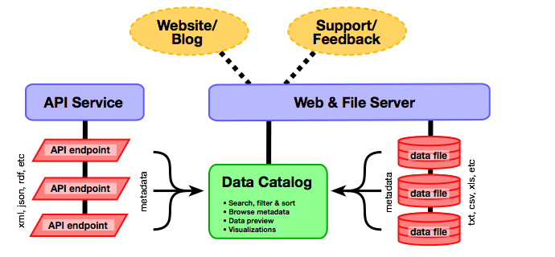
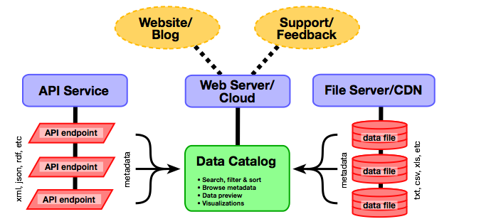

En esta sección se ofrece orientación sobre cómo seleccionar e
implementar distintas tecnologías utilizadas para desarrollar
plataformas de datos de libre acceso, haciendo especial hincapié en los
catálogos de datos, que son los sistemas web que se usan para poner los
datos a disposición de los usuarios finales. El propósito es ayudar a
los especialistas en tecnología de la información (TI) que cumplen una
función de coordinación en la gestión de la infraestructura técnica de
una iniciativa de datos de libre acceso.

Los términos "catálogo", "plataforma" y "portal" suelen ser ambiguos y
dan lugar a confusión. En este conjunto de herramientas, se definen de
la siguiente manera:

* Un **catálogo de datos** es una lista de conjuntos de datos
  disponibles en una iniciativa de datos de libre acceso. Los elementos
  esenciales de un catálogo de datos son: búsqueda, metadatos,
  información clara de la licencia de uso y acceso a las bases de datos
  propiamente dichas. Habitualmente, un catálogo de datos es el elemento
  central en línea de una iniciativa de datos de libre acceso.
* Una **plataforma** constituye "una puerta de acceso" en línea para que
  los usuarios lleguen a todos los recursos disponibles de una
  iniciativa de datos de libre acceso. Una plataforma incluye el
  catálogo de datos y otras informaciones y servicios que forman parte
  del ecosistema de datos de libre acceso. Habitualmente, estos son: un
  foro en línea para pregustas, apoyo técnico y comentarios; una base de
  conocimientos sobre información de referencia y materiales de
  capacitación, y un blog para las comunicaciones y la difusión. Los
  servicios de una plataforma se suelen implementar mediantes distintas
  tecnologías (no una sola).
* Un **portal** puede hace referencia a distintas cosas; por eso, en
  este conjunto de herramientas se evita el uso de este término.

## Qué aspecto tiene un catálogo de datos de libre acceso?   {#characteristics}

Como se describe en los próximos párrafos, los catálogos de datos pueden
ser relativamente simples e "independientes" o muy sofisticados y estar
integrados con otros sistemas. Sin embargo, la mayoría de los catálogos
de datos tienen algunas características comunes (también se pueden
consultar [listas más extensas][1]):

* **Fácil acceso**. Los catálogos de datos de libre acceso permiten que
  los usuarios accedan a los datos de manera rápida, gratuita e
  intuitiva. El acceso a los catálogos de datos abiertos no requiere
  inscripción ni ingreso, ya que esas exigencias disuadirían al usuario
  que desea explorar y utilizar las bases.

* **Búsqueda**. Los catálogos de datos de libre acceso facilitan la
  búsqueda. En la mayoría de los catálogos los datos se ordenan por
  tema, organización o tipo, y se permite una [búsqueda de texto
  completa][2] en sus contenidos. Muchos catálogos de datos de libre
  acceso incluyen una [optimización del motor de búsqueda][3] para
  transmitir los datos a motores de búsqueda convencionales.

* **Acceso a datos que puedan leerse con máquinas**. Los datos están
  disponibles para descarga en [formatos electrónicos que pueden leerse
  con máquinas y no son exclusivos](essentials.html#definition). En la
  medida de lo posible, es preferible tener todos los datos en un
  conjunto que se pueda descargar como un solo archivo.

* **Metadatos**. Los metadatos clave, como la fecha de la publicación y
  la autoría, se muestran claramente en cada conjunto de datos. En
  muchos catálogos de datos de libre acceso se implementa la [norma
  Dublin Core](supply.html#metadata) y los metadatos se ponen a
  disposición del público en formatos que se puedan leer con máquinas.

* **Licencias claras de uso de datos**. Las [licencias de uso de
  datos](essentials.html#licenses) se muestran claramente y en letras
  grandes en cada conjunto de datos. Si los datos se ofrecen en virtud
  de una licencia Creative Commons, la licencia de datos de libre acceso
  u otras normas, se incluyen enlaces explícitos a estas licencias.

* **Vista previa/visualización de datos**. Muchos catálogos de datos de
  libre acceso incluyen algún mecanismo para previsualizar los datos
  antes de descargarlos o para verlos mediante herramientas propias de
  generación de gráficos o mapas.

* **Cumplimiento de estándares**. La mayor parte de los catálogos de
  datos de libre acceso son capaces de leer distintos formatos estándar,
  ya sean de [datos][4] (por ejemplo, CSV, XML, JSON) o
  [metadatos](supply.html#metadata) (por ejemplo, Dublin Core). Los
  catálogos de datos de libre acceso suelen ofrecer cada conjunto de
  datos a través de una dirección URL única y permanente, lo que
  posibilita la mención y el enlace directo desde otros recursos.

* **Interfaz de programación de aplicaciones (API)**. Las API permiten a
  los desarrolladores de *software* acceder al catálogo de datos de
  libre acceso ---y, a menudo, a los propios datos--- a través del
  *software*. Las API permiten encontrar, analizar, integrar en
  catálogos, y [recolectar metadatos][5] de sitios externos y de una
  variedad de aplicaciones.

* **Seguridad**. Los catálogos de datos de libre acceso incorporan
  medidas de seguridad para evitar que usuarios no autorizados cambien
  los datos o metadatos.

Por lo general, los catálogos de datos de libre acceso siguen uno de dos
modelos de prestación de servicios. Los catálogos de **código abierto**
son teóricamente gratuitos porque pueden obtenerse mediante una descarga
sin costo alguno y pueden modificarse o adaptarse sin restricciones ni
cargos de licencias. Estos productos pueden alojarse en los propios
servidores exclusivos del propietario o en la nube, pero ambos enfoques
requieren que el operador del catálogo administre la logística de TI.
Algunos proveedores ofrecen alojamiento de productos de código abierto
en la nube como un servicio. Por el contrario, los productos de
***software* como servicio** (SaaS) están disponibles a cambio del pago
de una cuota mensual o anual, y los proveedores asumen la
responsabilidad de la gestión de TI, la seguridad y las actualizaciones
de *software*. Los proveedores de SaaS también pueden proporcionar
ciertas medidas de adaptación de productos.

## Tres modelos de catálogos de datos de libre acceso   {#models}

Los tres modelos que se describen a continuación presentan formas de
concebir un sistema de catálogo de datos de libre acceso. La intención
es mostrar cómo se relacionan entre sí los distintos elementos y cómo
cambia el sistema en diferentes escalas.

Haga clic en los gráficos para verlos en tamaño completo.

BEGIN INTERACTIVE MODEL CHART 

<ul>
<li><a id="model1-click" href="#model1">Modelo 1</a></li>
<li><a id="model2-click" href="#model2">Modelo 2</a></li>
<li><a id="model3-click" href="#model3">Modelo 3</a></li>
<!--
<li><a id="model4-click" href="#model4">Model 4</a></li>
-->
</ul>

### Modelo 1: Plataforma única   {#model-1-single-platform}

Este modelo muestra una infraestructura de TI simple en la que el
catálogo de datos y los archivos de datos se alojan en el entorno de un
servidor único. El servidor podría estar administrado internamente por
el organismo principal o podría alojarse en la nube. Los conjuntos de
datos manejados por API, si existen, pueden gestionarse por separado
siguiendo los requisitos de las tecnologías que les corresponden.

La publicación en blogs, el apoyo a los usuarios y los comentarios son
elementos esenciales de la participación de los usuarios en una
iniciativa de datos de libre acceso; a menudo estas funciones pueden
proporcionarse a través de la misma infraestructura utilizada en el
catálogo (o una infraestructura similar). Sin embargo, conceptualmente,
son sistemas separados que solo se conectan vagamente con el catálogo de
datos.

Este modelo es adecuado cuando existe un número reducido de conjuntos de
datos (menos de 200) en el catálogo de datos, cuando los conjuntos son
pequeños (menos de 100 Mb) y cuando un único organismo tiene un papel
prominente en la coordinación del catálogo de datos y la gestión de la
infraestructura de TI.

### Modelo 2: Servidores separados   {#model-2-separate-servers}

Este modelo muestra cómo podrían administrarse por separado el catálogo
de datos y el servidor de archivos utilizando infraestructura alojada
internamente o en la nube. Este enfoque es algo más sofisticado que el
<a class="model-link" href="#model1">modelo 1</a> y es más adecuado para conjuntos de
datos y catálogos más grandes. Alojar la infraestructura en la nube
suele ser un enfoque eficaz en función de los costos, pero puede no ser
práctico en regiones donde el ancho de banda es muy limitado.

### Modelo 3: Catálogos federados   {#model-3-federated-catalogs}

Este modelo muestra el modo en que la gestión del catálogo de datos de
libre acceso puede descentralizarse a uno o más de los ministerios
contribuyentes. En este enfoque, algunos archivos de datos o servicios
de API se gestionan desde ministerios separados, mientras que los
metadatos se siguen incorporando en el catálogo central para permitir
búsquedas y acceso entre ministerios. Un ministerio incluso puede operar
su propio catálogo (por ejemplo, datos geoespaciales o estadísticas de
educación) y brindar apoyo al mismo tiempo al catálogo central, como se
muestra en el caso del "Ministerio C".

Este modelo es adecuado cuando uno o más ministerios tienen la capacidad
y experiencia para gestionar sus propios datos de libre acceso. Los
ministerios que no tienen esta capacidad pueden optar por confiar en el
organismo de ejecución, como se muestra en el
<a class="model-link" href="#model1">Model 1</a> o el <a class="model-link" href="#model2">Model 2</a>.

<!--

### Model 4: Workflow Integration

This model is a simple extension of <a class="model-link" href="#model3">Model 3</a>. In this approach, some ministries may choose to manage open data assets via
separate data management systems. This is entirely possible so long as the the back-end can provide public access to (or
simple export of) open datasets in open, machine-readable formats.

-->

 END INTERACTIVE MODEL CHART 

## Plataformas de datos de libre acceso más utilizadas   {#platforms}

### CKAN   {#ckan}

[CKAN][6] es un catálogo de código abierto mantenido formalmente por la
[Fundación Open Knowledge][7], que puede instalarse en cualquier
servidor Linux, incluso en configuraciones de alojamiento en la nube. La
Fundación Open Knowledge también ofrece servicios de alojamiento con
costo mensual. CKAN está programado en el lenguaje Python y está
diseñado para publicar y administrar datos ya sea mediante una interfaz
de usuario o una API. CKAN presenta una arquitectura modular que permite
agregar características adicionales o específicas.

**Ejemplos**

* [Edo (Nigeria)][8]
* [Brasil][9]
* [Estados Unidos][10]
* [Datos de libre acceso de África][11]

### DKAN   {#dkan}

[DKAN][12] está diseñado para ser una "función compatible" con CKAN.
Esto significa que su API subyacente es idéntica, por lo que los
sistemas diseñados para ser compatibles con la API de CKAN deberían
funcionar también con DKAN. DKAN también es de código abierto, pero se
basa en Drupal, un conocido sistema de gestión de contenidos programado
en PHP en vez de Python. Esto puede resultar más interesante para
organizaciones que ya han invertido en sitios web basados en Drupal.
Drupal tiene su propia arquitectura modular, con miles de módulos
disponibles para descargar. También ofrece la opción de personalizar los
módulos y cuenta con una extensa comunidad de desarrolladores.

**Ejemplos**

* [Colonia (Alemania)][13]

### Junar   {#junar}

[Junar][14] es una plataforma de datos de libre acceso SaaS que se aloja
en la nube, por lo que habitualmente los datos se gestionan dentro de la
infraestructura de la propia plataforma (el modelo "todo en uno"). Junar
puede ofrecer un catálogo de datos completo o datos a través de una API
para un catálogo de otro usuario.

**Ejemplos**

* [Lima (Perú)][15]
* [Chile][16]
* [Costa Rica][17]

### OpenDataSoft   {#opendatasoft}

[OpenDataSoft][18] es una plataforma de SaaS alojada en la nube que
ofrece un conjunto extenso de herramientas de datos de libre acceso y
visualización. La plataforma acepta formatos comunes de datos de libre
acceso, como CSV, JSON y XML, así como varios formatos geoespaciales,
como KML, OSM y SHP. La función de búsqueda es muy sencilla y fácil de
usar.

**Ejemplos**

* [Open Data Brussels](opendata.brussels.be)
* [Paris Data](opendata.paris.fr)
* [SNCF](data.sncf.com)

### Semantic MediaWiki   {#semantic-media-wiki}

[Semantic MediaWiki][19] es una extensión de [MediaWiki][20], la
aplicación wiki más conocida por ser la base de [Wikipedia][21]. Si bien
las wikis tradicionales solo contienen texto, Semantic MediaWiki agrega
anotaciones semánticas que permiten que una wiki funcione como una base
de datos colaborativa y un catálogo de datos. Semantic MediaWiki es una
implementación [RDF][22], lo que significa que tanto los datos como los
metadatos se almacenan como datos enlazados y se puede acceder a ellos a
través de interfaces de datos tales como [SPARQL][23].

**Ejemplos**

* [OpenEI](openei.org)

### Socrata   {#socrata}

[Socrata][24] es una plataforma de catálogo de datos de libre acceso
SaaS alojada en la nube que ofrece una API, un catálogo y herramientas
de manejo de los datos. Una característica distintiva de Socrata es que
permite a los usuarios crear vistas y visualizaciones a partir de los
datos publicados y guardarlas para que las usen otros visitantes.
Además, Socrata ofrece una versión de código abierto de su API,
destinada a facilitar la transición a clientes que deciden migrar desde
el modelo SaaS.

**Ejemplos**

* [Chicago (Estados Unidos)][25]
* [San Francisco (Estados Unidos)][26]
* [Kenya][27]
* [Programa de las Naciones Unidas para el Desarrollo][28]

### Swirrl   {#swirrl}

[Swirrl][29] es una plataforma de datos de libre acceso SaaS alojada en
la nube que se construyó con tecnologías de datos vinculadas (como
[RDF][22] y [SPARQL][23]); está diseñada para ser un 100 % compatible
con el [modelo 5-Star Open Data][30]. Sin embargo, Swirrl también brinda
acceso a datos a través de estructuras más convencionales, como CSV.

**Ejemplos**

* [OpenDataCommunities](opendatacommunities.org)
* [Open Data Scotland](opendatascotland.org)
* [Municipio de Hampshire](linkeddata.hants.gov.uk)

## Lectura adicional   {#additional-reading}

En estos enlaces se puede encontrar más información y antecedentes sobre
opciones tecnológicas.

* [Opciones tecnológicas para plataformas de datos gubernamentales de
  libre acceso](../docs/OGDPlatforms-White-Paper.docx) (Banco Mundial,
  enero de 2014). En este documento técnico se analizan las
  características de varios productos y servicios proporcionados por
  diferentes organizaciones.
* [Evaluación técnica de plataformas de datos de libre acceso para
  organismos nacionales de estadística][31] (Banco Mundial, octubre de
  2014). El objetivo de este informe de investigación es permitir una
  mejor comprensión y evaluación de las cuestiones técnicas relacionadas
  con las herramientas de divulgación de datos que utilizan las oficinas
  nacionales de estadística para distribuir datos al público en el marco
  de una iniciativa de datos de libre acceso.
* [Lista de comprobación sobre datos de libre acceso][1]. Esta lista de
  mejores prácticas relacionadas con los datos de libre acceso es una
  buena referencia para comprobar los requisitos habituales de una
  plataforma de datos.
* [Presentación de ODI: Cómo seleccionar la plataforma de datos de libre
  acceso adecuada][32] (Open Data Institute, 2014). Esta presentación de
  diapositivas ofrece una reseña exhaustiva de las principales
  consideraciones a la hora de elegir una plataforma de datos de libre
  acceso e incluye un resumen de varios de los productos principales.

[1]: https://checklists.opquast.com/en/opendata
[2]: http://en.wikipedia.org/wiki/Full_text_search
[3]: http://en.wikipedia.org/wiki/Search_engine_optimization
[4]: http://opendatahandbook.org/guide/en/appendices/file-formats
[5]: https://www.data.gov/developers/harvesting
[6]: http://ckan.org/
[7]: http://okfn.org
[8]: http://data.edostate.gov.ng/
[9]: http://dados.gov.br/
[10]: http://catalog.data.gov/
[11]: http://africaopendata.org/
[12]: http://nucivic.com/dkan
[13]: http://www.offenedaten-koeln.de/
[14]: http://www.junar.com
[15]: http://lima.datosabiertos.pe
[16]: http://recursos.datos.gob.cl
[17]: http://datosabiertos.gob.go.cr
[18]: http://www.opendatasoft.com
[19]: http://semantic-mediawiki.org
[20]: https://www.mediawiki.org
[21]: http://en.wikipedia.org
[22]: http://www.w3.org/RDF
[23]: http://en.wikipedia.org/wiki/SPARQL
[24]: http://www.socrata.com
[25]: https://data.cityofchicago.org
[26]: https://data.sfgov.org
[27]: https://opendata.go.ke
[28]: https://data.undp.org
[29]: http://www.swirrl.com
[30]: http://5stardata.info
[31]: http://documents.worldbank.org/curated/en/2014/10/20451797/technical-assessment-open-data-platforms-national-statistical-organisations
[32]: http://www.scribd.com/doc/246134303/How-to-choose-the-right-open-data-platform-for-you
