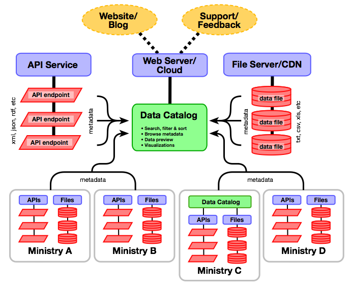

Cette rubrique fournit des recommandations concernant la sélection et la
mise en place des différentes technologies utilisées pour développer une
plateforme Open Data. Elle traite plus particulièrement des
catalogues de données ouvertes, ce terme désignant les systèmes en ligne
qui servent à mettre les données à la disposition des utilisateurs
finaux. Elle s'adresse aux informaticiens chargés de diriger ou de
coordonner la gestion de l'infrastructure technique associée à une
initiative de données ouvertes.

Les termes « catalogue », « plateforme » et « portail » sont souvent
ambigus et peuvent porter à confusion. Ce guide pratique définit ces
termes de la manière suivante :

* Un **catalogue de données** désigne la liste des jeux de données
  disponibles dans le cadre d'une initiative de Données Ouvertes. Les
  principaux éléments d'un outil de catalogage de données sont les
  capacités de recherche, les métadonnées, les informations relatives à
  la licence et, bien sûr, l'accès aux jeux de données eux-mêmes. Il
  s'agit en général de la clé de voûte d'une initiative d'Open Data.
* Une **plateforme** fournit aux utilisateurs une « porte d'entrée » qui
  leur permet d'accéder à toutes les ressources disponibles dans le
  cadre d'une initiative de données ouvertes. Outre le catalogue
  de données, elle comprend aussi d'autres informations et services qui
  font partie de l'écosystème de l'Open Data. Il s'agit généralement
  d'un forum dédié aux questions, à l'assistance technique et aux
  commentaires, d'une base de connaissances contenant de la
  documentation et du matériel didactique, et d'un blog pour communiquer
  et diffuser des informations. Les services disponibles au sein d'une
  plateforme sont souvent mis en place au moyen de plusieurs
  technologies et non d'une seule.
* Le terme de **portail** peut désigner bien des choses différentes.
  Aussi ce guide pratique évite-t-il de l'utliser pour éviter toute
  confusion.

## Un catalogue de données ouvertes, c'est quoi?   {#characteristics}

Comme le décrivent les paragraphes suivants, les catalogues de données
peuvent être relativement simples et autonomes, ou très sophistiqués et
intégrés à d'autres systèmes. Toutefois, la plupart d'entre eux ont un
certain nombre de caractéristiques communes (des listes plus complètes
sont [également disponibles][1]):

* **Facilité d'accès**: les catalogues permettent aux utilisateurs
  d'accéder aux données de manière facile, rapide, intuitive et
  gratuite. L'accès à ces catalogues ne nécessite ni inscription ni
  connexion, car cela risquerait de décourager les utilisateurs de les
  consulter et de les exploiter.

* **Recherche**: les catalogues permettent de trouver facilement des
  données. La plupart d'entre eux classent les données par sujet,
  organisme ou type, et prennent en charge la [recherche en texte
  intégral][2]. Bon nombre de catalogues intègrent aussi l'[optimisation
  du référencement auprès des moteurs de recherche][3] afin que ceux-ci
  puissent accéder aux données.

* **Accès aux données exploitables par une machine**: les données sont
  disponibles en téléchargement dans des [formats électroniques non
  propriétaires exploitables par une
  machine](essentials.html#definition). Dans la mesure du possible, il
  est préférable que toutes les données d'un jeu de données soient
  disponibles sous la forme d'un fichier téléchargeable unique.

* **Métadonnées**: les métadonnées essentielles telles que la date de
  publication et la source sont affichées de manière bien visible pour
  chaque jeu de données. De nombreux catalogues utilisent la [norme
  Dublin Core](supply.html#metadata) et publient les métadonnées dans
  des formats exploitables par une machine.

* **Clarté des licences applicables aux données**: les [licences
  applicables aux données](essentials.html#licenses) sont clairement
  indiquées pour chaque jeu de données. Si les données sont soumises à
  une licence Creative Commons, Open Data ou relevant d'une autre norme,
  des liens transparents vers ces licences sont inclus.

* **Aperçu/visualisation des données**: de nombreux catalogues
  permettent d'afficher un aperçu des données avant téléchargement ou de
  les visualiser à l'aide d'outils graphiques ou cartographiques
  intégrés.

* **Respect des normes**: la plupart des catalogues offrent une prise
  en charge intégrée de différentes normes, notamment en matière de
  [formats de données][4] (par exemple CSV, XML et JSON) et de
  [métadonnées](supply.html#metadata) (Dublin Core). Généralement, les
  catalogues publient chaque jeu de données sous la forme d'une URL
  permanente unique, ce qui permet de citer les données et de créer des
  liens directs vers celles-ci.

* **Interface de programmation d'application (API)**: les API
  permettent aux développeurs de logiciels d'accéder de manière
  automatisée aux catalogues, et même souvent aux données elles-mêmes.
  Elles facilitent la découverte des données, l'analyse, l'intégration
  des catalogues, [la collecte des métadonnées][5] depuis des sites
  externes et le développement d'une multitude d'applications.

* **Sécurité**: les catalogues mettent en place des mesures de
  sécurité pour protéger les données et les métadonnées contre toute
  modification de la part d'utilisateurs non autorisés.

Les catalogues de données relèvent généralement de l'un ou l'autre des
deux modèles suivants. Les catalogues **open source** sont en principe
gratuits, dans le sens où ils peuvent être téléchargés sans frais, et
peuvent être modifiés ou personnalisés sans restriction ni droits de
licence. Ces produits peuvent être hébergés sur les propres serveurs du
propriétaire ou au sein d'une infrastructure Cloud, mais ces deux
approches nécessitent que l'opérateur du catalogue gère la logistique
informatique. Certains fournisseurs proposent des services d'hébergement
Cloud pour les produits open source. Autre possibilité, des produits
**SaaS** (logiciels en tant que service) sont proposés par différents
fournisseurs pour un abonnement mensuel ou annuel, ces derniers assumant
alors la gestion informatique, la sécurité et les mises à jour
logicielles. Les fournisseurs de solutions SaaS peuvent également
proposer un certain degré de personnalisation.

## Trois modèles possibles    {#models}

Les trois modèles ci-dessous présentent les différentes façons
d'envisager un système de catalogage des données ouvertes L'objectif est
ici de montrer comment les différents éléments et services sont reliés
les uns aux autres, et comment le système évolue à différentes échelles.

Cliquez sur le graphique ci-dessous pour l'afficher en taille réelle.

BEGIN INTERACTIVE MODEL CHART 

<ul>
<li><a id="model1-click" href="#model1">Modèle 1</a></li>
<li><a id="model2-click" href="#model2">Modèle 2</a></li>
<li><a id="model3-click" href="#model3">Modèle 3</a></li>
<!--
<li><a id="model4-click" href="#model4">Modèle 4</a></li>
-->
</ul>

### Modèle 1 : Plateforme unique   {#model-1-single-platform}

Ce modèle montre une infrastructure informatique simple dans laquelle le
catalogue de données et les fichiers de données sont hébergés au sein
d'un même environnement serveur. Le serveur peut être géré en interne
par l'organisme responsable ou être hébergé dans le Cloud. Les éventuels
jeux de données pilotés par une API peuvent être gérés séparément selon
les exigences de la technologie sous-jacente.

Les blogs, l'assistance utilisateur et les commentaires constituent des
éléments essentiels pour inciter les utilisateurs à s'impliquer dans une
initiative d'Open Data, et sont souvent fournis par la même
infrastructure (ou une infrastructure similaire) que celle qui est
utilisée par le catalogue lui-même. Sur le plan conceptuel, il s'agit
néanmoins de systèmes distincts qui ne sont que faiblement connectés au
catalogue de données.

Ce modèle est adapté lorsqu'il y a un petit nombre de jeux de données
(moins de 200) dans le catalogue de données, que les jeux de données
sont de petite taille (moins de 100 Mo), et qu'un seul organisme joue un
rôle important dans la coordination du catalogue de données et la
gestion de l'infrastructure informatique.

### Modèle 2 : Serveurs distincts   {#model-2-separate-servers}

Ce modèle montre comment le catalogue de données et le serveur de
fichiers peuvent être gérés de manière distincte en utilisant soit une
infrastructure hébergée en interne, soit une infrastructure hébergée
dans le Cloud. Cette approche est seulement un peu plus sophistiquée que
le <a class="model-link" href="#model1">modèle 1</a>, et convient davantage aux jeux de
données et catalogues de taille supérieure. L'infrastructure hébergée
dans le Cloud constitue souvent une approche plus économique, mais elle
peut s'avérer peu pratique dans les régions où la bande passante est
très limitée.

### Modèle 3 : Catalogues fédérés   {#model-3-federated-catalogs}

Ce modèle montre comment la gestion du catalogue peut être décentralisée
auprès d'un ou plusieurs ministères contribuant au projet. Dans cette
approche, certains fichiers de données et/ou services d'API sont gérés
par des ministères distincts, tandis que les métadonnées restent
fournies au catalogue central pour offrir des capacités d'accès et de
recherche interministérielles. Un ministère peut même avoir son propre
catalogue (par exemple des données géospatiales ou des statistiques sur
l'éducation) tout en continuant de contribuer au catalogue central,
comme le montre le ministère C.

Ce modèle est approprié lorsqu'un ou plusieurs ministères ont les
capacités et l'expérience requises pour gérer leurs propres données
ouvertes. Les ministères qui n'ont pas ces capacités peuvent choisir de
s'appuyer sur l'organisme chargé de la mise en œuvre, comme dans le
<a class="model-link" href="#model1">modèle 1</a> ou le <a class="model-link" href="#model2">modèle 2</a>.

<!--

### Model 4: Workflow Integration

This model is a simple extension of <a class="model-link" href="#model3">Model 3</a>. In this approach, some ministries may choose to manage open data assets via
separate data management systems. This is entirely possible so long as the the back-end can provide public access to (or
simple export of) open datasets in open, machine-readable formats.

-->

 END INTERACTIVE MODEL CHART 

## Plateformes de Données Ouvertes couramment utilisées   {#platforms}

### CKAN   {#ckan}

[CKAN][6] est un catalogue de données open source qui bénéficie du
soutien officiel de l'[Open Knowledge Foundation][7] et peut être
installé sur n'importe quel serveur Linux, y compris dans une
configuration hébergée dans le Cloud. L'Open Knowledge Foundation
propose également des services d'hébergement sous forme d'abonnement
mensuel payant. Le catalogue CKAN est écrit dans le langage de
programmation Python et conçu pour publier et gérer des données au moyen
d'une interface utilisateur ou d'une API. CKAN présente une architecture
modulaire qui permet d'ajouter des fonctionnalités supplémentaires ou
personnalisées.

**Exemples**

* [Edo (Nigéria)][8]
* [Brésil][9]
* [États-Unis][10]
* [openAFRICA][11]

### DKAN   {#dkan}

[DKAN][12] est conçu pour être compatible avec CKAN. Cela signifie que
son API sous-jacente est identique, de sorte que les systèmes conçus
pour être compatibles avec l'API CKAN sont censés fonctionner tout aussi
bien avec DKAN. DKAN est aussi open source, mais repose sur Drupal, un
système de gestion de contenu très populaire qui est écrit en PHP au
lieu de Python. Cette plateforme peut sembler plus attrayante pour les
organismes qui ont déjà investi dans des sites web basés sur Drupal.
Drupal possède sa propre architecture modulaire, avec des milliers de
modules disponibles en téléchargement. Ce logiciel permet également de
personnaliser les modules et possède une grande communauté de
développeurs.

**Exemples**

* [Cologne (Allemagne)][13]

### Junar   {#junar}

[Junar][14] est une plateforme Open Data de type SaaS hébergée dans le
Cloud, ce qui signifie que les données sont généralement gérées au sein
de l'infrastructure Junar (modèle tout-en-un). Junar peut fournir soit
un catalogue de données complet, soit des données spécifiques qui sont
envoyées dans un catalogue utilisateur séparé via une API.

**Exemples**

* [Lima (Pérou) ][15]
* [Chili ][16]
* [Costa Rica ][17]

### OpenDataSoft   {#opendatasoft}

[OpenDataSoft][18] est une plateforme de type SaaS hébergée dans le
Cloud qui offre une suite complète d'outils Open Data et de
visualisation. Cette plate-forme prend en charge les formats de données
ouvertes les plus courants comme CSV, JSON et XML, ainsi qu'un
grand nombre de formats de données géospatiales tels que KML, OSM et
SHP. Ses fonctionnalités de recherche sont à la fois simples et faciles
d'utilisation.

**Exemples**

* [Open Data Bruxelles ](opendata.brussels.be)
* [ParisData](opendata.paris.fr)
* [Open Data SNCF](data.sncf.com)

### Semantic MediaWiki   {#semantic-media-wiki}

[Semantic MediaWiki][19] est une extension de [MediaWiki][20],
l'application qui est connue pour être celle sur laquelle repose
[Wikipédia][21]. Alors que les wikis classiques ne contiennent que du
texte, Semantic MediaWiki ajoute des annotations sémantiques qui
permettent à un wiki de se comporter comme une base de données
collaborative et un catalogue de données. Semantic MediaWiki est une
implémentation de [RDF][22], ce qui signifie que les données et les
métadonnées sont stockées sous la forme de données liées et accessibles
par le biais d'interfaces de données liées telles que [SPARQL][23].

**Exemples**

* [OpenEI ](openei.org)

### Socrata   {#socrata}

[Socrata][24] est une plateforme de catalogue Open Data de type SaaS
hébergée dans le Cloud qui fournit une API, un catalogue et des outils
de manipulation des données. L'une des particularités de Socrata est
qu'il permet aux utilisateurs de créer des vues et des visualisations
basées sur les données publiées et de les enregistrer pour que d'autres
personnes puissent les utiliser. Par ailleurs, Socrata propose une
version open source de son API qui est conçue pour simplifier la
transition pour les clients qui souhaitent abandonner le modèle SaaS.

**Exemples**

* [Chicago (États-Unis) ][25]
* [San Francisco (États-Unis) ][26]
* [Kenya ][27]
* [PNUD ][28]

### Swirrl   {#swirrl}

[Swirrl][29] est une plateforme Open Data de type SaaS hébergée dans le
Cloud qui est basée sur les technologies de données liées (comme
[RDF][22] [a] et [SPARQL][23]) et conçue pour offrir une conformité
totale avec le [modèle Open Data 5 étoiles][30]. Swirrl met également
les données à disposition sous des formes plus traditionnelles telles
que le format CSV.

**Exemples**

* [OpenDataCommunities ](opendatacommunities.org)
* [Open Data Scotland ](opendatascotland.org)
* [Hampshire City Council](linkeddata.hants.gov.uk)

## Pour aller plus loin...   {#additional-reading}

Les liens suivants fournissent des informations supplémentaires et plus
de documentation sur les options technologiques en matière de données
ouvertes.

* [*Technology Options for Open Government Data
  Platforms*](../docs/OGDPlatforms-White-Paper.docx) (Banque mondiale,
  janvier 2014) : ce livre blanc passe en revue les caractéristiques de
  plusieurs produits et services proposés par différentes organisations.
* [*Technical Assessment of Open Data Platforms for National Statistical
  Organisations*][31] (Banque mondiale, octobre 2014) : ce rapport de
  recherche vise à améliorer la compréhension et l'évaluation des
  problèmes techniques liés aux outils de diffusion de données
  qu'utilisent les instituts de statistique nationaux pour communiquer
  les informations aux citoyens dans le cadre d'une initiative de libre
  accès aux données.
* [*Open Data Checklist*][1] : cet aide-mémoire qui récapitule les
  bonnes pratiques en matière de Données Ouvertes constitue une référence utile
  pour garder à l'esprit les grandes exigences que doit généralement
  respecter toute plateforme de données ouvertes.
* [<em> ODI : How to choose the right Open Data platform for
  you</em>][32] (Open Data Institute, 2014) : ce diaporama offre une
  présentation complète des principaux aspects à prendre en
  considération pour choisir une plateforme de Données Ouvertes et offre un
  bref aperçu de certains des produits les plus utilisés.

[1]: https://checklists.opquast.com/en/opendata
[2]: https://fr.wikipedia.org/wiki/Recherche_plein_texte
[3]: https://fr.wikipedia.org/wiki/Optimisation_pour_les_moteurs_de_recherche
[4]: http://opendatahandbook.org/en/appendices/file-formats.html
[5]: https://www.data.gov/developers/harvesting
[6]: http://ckan.org/
[7]: http://okfn.org
[8]: http://data.edostate.gov.ng/
[9]: http://dados.gov.br/
[10]: http://catalog.data.gov/
[11]: http://africaopendata.org/
[12]: http://nucivic.com/dkan
[13]: http://www.offenedaten-koeln.de/
[14]: http://www.junar.com
[15]: http://lima.datosabiertos.pe
[16]: http://recursos.datos.gob.cl
[17]: http://datosabiertos.gob.go.cr
[18]: http://www.opendatasoft.com
[19]: http://semantic-mediawiki.org
[20]: https://fr.wikipedia.org/wiki/MediaWiki
[21]: https://fr.wikipedia.org/wiki/Wikip%C3%A9dia:Accueil_principal
[22]: http://www.w3.org/RDF
[23]: https://fr.wikipedia.org/wiki/SPARQL
[24]: http://www.socrata.com
[25]: https://data.cityofchicago.org
[26]: https://data.sfgov.org
[27]: https://opendata.go.ke
[28]: https://data.undp.org
[29]: http://www.swirrl.com
[30]: http://5stardata.info
[31]: http://documents.worldbank.org/curated/en/2014/10/20451797/technical-assessment-open-data-platforms-national-statistical-organisations
[32]: http://www.scribd.com/doc/246134303/How-to-choose-the-right-open-data-platform-for-you
